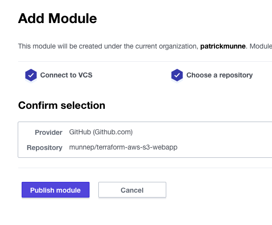

# How to create and use Private Modules

This repository describes how to create a private module within your Terraform Cloud and then how to use this module with Terraform Cloud

This repository is based on this [tutorial](https://learn.hashicorp.com/tutorials/terraform/module-private-registry-share?in=terraform/modules)


# Prerequisites

- You must have a Terraform Cloud account. See [documentation](https://learn.hashicorp.com/tutorials/terraform/cloud-sign-up#create-an-account)  
- A github account
- [OAuth Access](https://www.terraform.io/docs/cloud/vcs/github.html) to Github configured

# How to

## Create a private module within Terraform cloud

1. Fork the below repository to your own environment  
[https://github.com/munnep/terraform-aws-s3-webapp](https://github.com/munnep/terraform-aws-s3-webapp)
2. Keep the name like the following format
```
terraform-<PROVIDER>-<NAME>
```
3. Tag a release to your repository in the following format
Example  
  
```
1.0.1
```
4. Go to Terraform cloud and login to import the forked module within you registry
5. Go to registry  
    
6. select publish a module  
  
7. Connect to your github account  
    
8. select the repository you just forked and tagged    
  
9. Publish the module  
  
10. You should now see your module imported  
   


## Use the private module

You are now going to actually use the private module you used created. 

1. Fork this repository to your own account  
```
https://github.com/munnep/learn-private-module-root
```
2. in the file ```main.tf``` change the link to your own organization and change the version to the tag release you gave it. 
```
module "s3-webapp" {
  source  = "app.terraform.io/patrickmunne/s3-webapp/aws"
  name        = var.name
  region = var.region
  prefix = var.prefix
  version = "1.0.0"
}

```
3. Go into your Terraform Cloud account
4. Create a new workspace      
  
5. choose Version Control Workflow  
  
6. Connect to github  
  
7. select the repository you forked and altered in this chapter  
  
8. create the workspace  
  
9. Go into the workspace and change the variables as below     
  
10. Start a plan to create it    
  
11. Confirm and apply the plan  
  
12. After the apply your resources should be created  
  
13. Destroy your environment. Go to settings and Destruction and Deletion  
  
14. Manually destroy   
  
15. Queue destroy plan  
  
16. Confirm and apply  
  